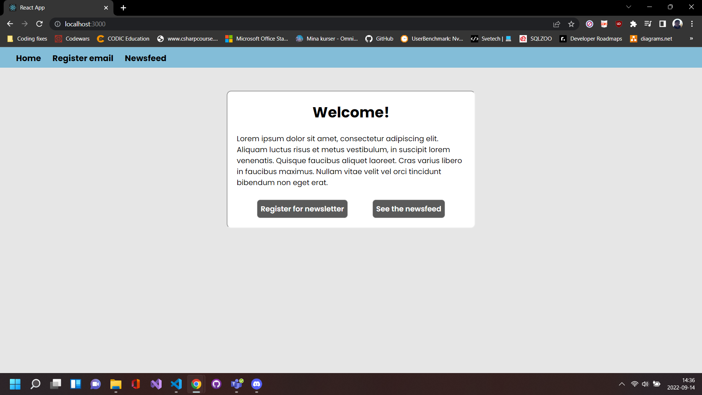
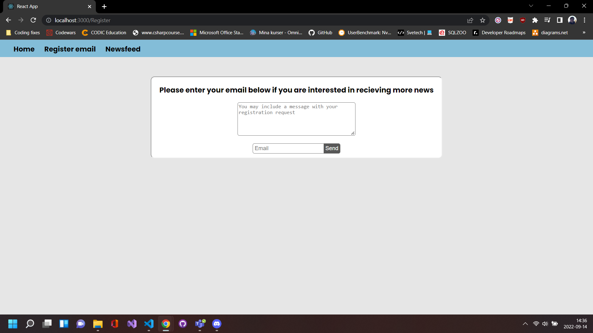
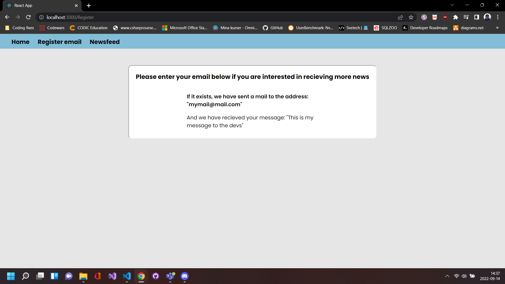
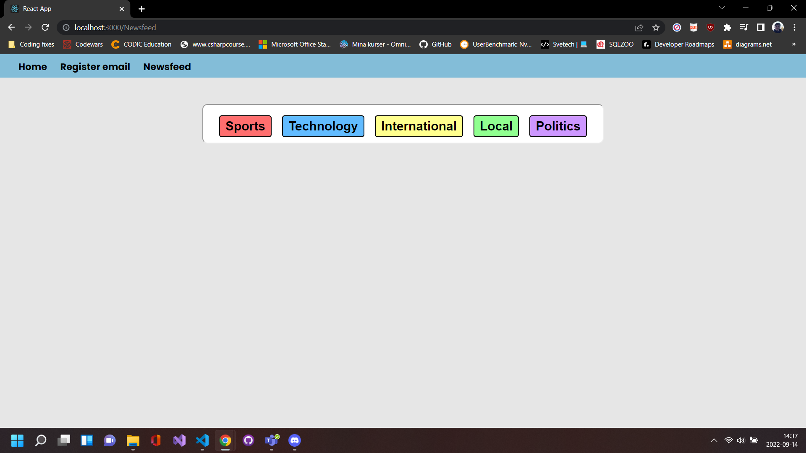
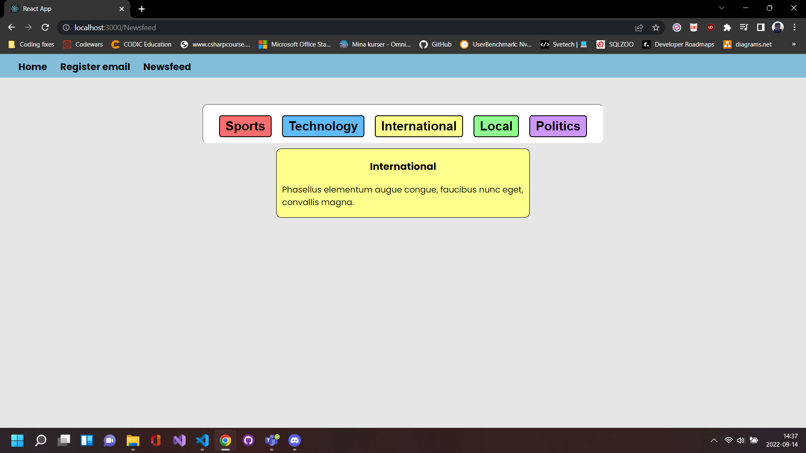
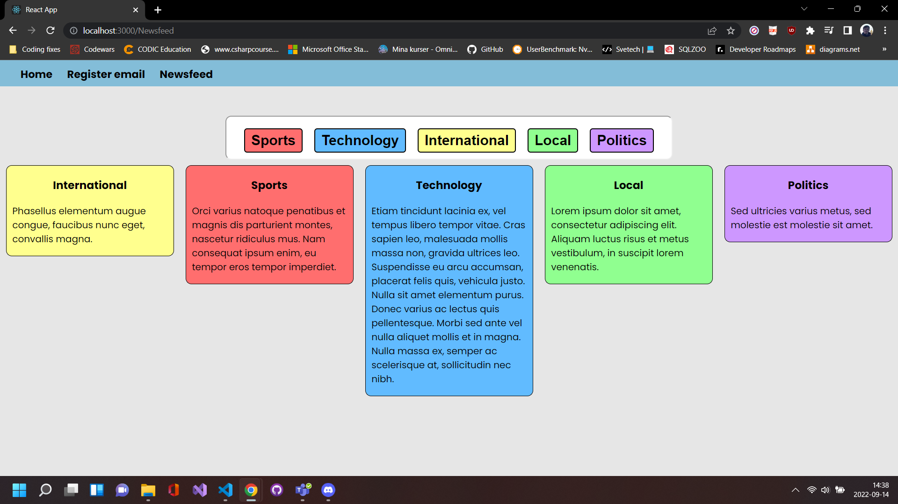

#### Sebastian Gustafsson

# React submission

## Implementation

This app is supposed to simulate a news-app where you choose what type of new you want to see (i.e technology, sports, world news...). It is a single page application that uses react-router-dom in order to replace the content in the html file "index.html" which can be found in public folder.

All views make use of the "Links.jsx"-component in order to create navigational links in the header.

The home section is the first view, and its code can be found in "App.js" in the src folder. 

It is used as a navigational view and welcomes the use to the webpage. The view contains a card with information (lorem ipsum) about the site, and two buttons, one for going to the registration view, and one for going to the newsfeed view.  

The next view is the register-view, and its code can be found in "Register.jsx" in the routes folder. It makes use of the "Form.jsx"-component to create a form for the user.

In this view the user can submit their email and a message to send to the developers. Nothing is actually sent, but the email and message will be displayed on the page.

If no text in the mail-field is provided the neither the message nor the mail will be stored with and updated "useState hook" and a message will be displayed saying: "No email address entered". If no message is entered but a mail is, the text saying: "we have recieved your message" will not be displayed.

The final view is the newsfeed-view, and its code can be found in "Newsfeed.jsx" in the routes folder. It is making use of the "Topics.jsx"-component in order to display topics and news to the user

The user can click on any topic button they want and a news-card will pop up displaying relevant news.

If the user clicks on a topic button again the relevant news card will disapear. Multiple news cards will appear if the user click on multiple topic buttons.

